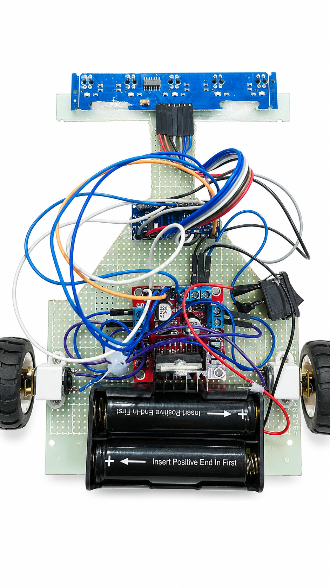
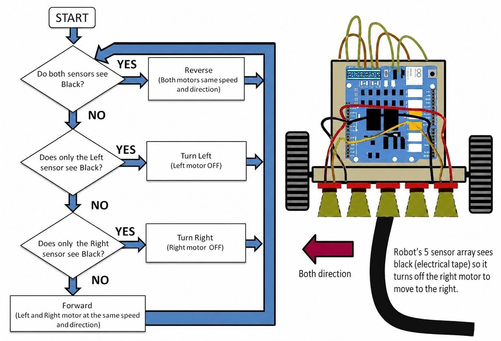

# Autonomous Food Delivery Robot

## Overview

This project presents the design and implementation of an Autonomous Line Following Food Delivery Robot using Arduino Nano and PD Control Algorithm.

The robot is capable of autonomously following predefined paths using a 5-channel IR sensor array and dynamically adjusting motor speed for stable navigation.

---

## Features

- Autonomous Line Following
- PD-Based Navigation Control
- Real-Time Error Correction
- Stable Path Tracking
- Low-Cost Embedded System
- Smart Restaurant Delivery Concept

---

## Hardware Components

- Arduino Nano
- L298N Motor Driver
- 5-Channel IR Sensor Array
- N20 DC Gear Motors
- 18650 Battery Pack
- Robot Chassis

---

## Software Tools

- Arduino IDE
- Embedded C/C++
- LaTeX

---

## Project Structure

```text
├── images
├── thesis.pdf
├── thesis.tex
├── autonomous_food_delivery_robot.ino
└── README.md
```

---

## Thesis

The complete thesis paper is included in this repository.

---

## Author

Sreemanta Bonik

Department of Computer Science and Engineering

Port City International University

---

## Robot Prototype



---

## Flowchart



---

## System Architecture


---

## Thesis PDF

[Download Thesis](thesis.pdf)
## License

MIT License
